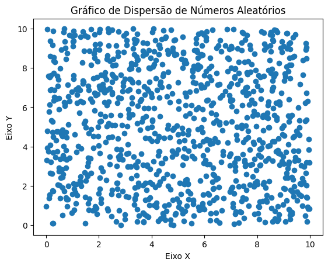

# Projeto de Gráfico em Python

Este projeto é uma aplicação em Python para a criação e visualização de gráficos. Utiliza bibliotecas populares para manipulação de dados e geração de gráficos.

## Funcionalidades

- Leitura de dados a partir de arquivos CSV
- Geração de gráficos de linha, barra e pizza
- Personalização de gráficos (títulos, legendas, cores)
- Exportação de gráficos em formatos de imagem

## Tecnologias Utilizadas

- Python 3.x
- Matplotlib
- Pandas

## Como Executar

1. Clone o repositório:
    ```bash
    git clone https://github.com/seu-usuario/seu-repositorio.git
    ```
2. Navegue até o diretório do projeto:
    ```bash
    cd /d:/programacao/Python/Grafico
    ```
3. Instale as dependências:
    ```bash
    pip install -r requirements.txt
    ```
4. Execute o script principal:
    ```bash
    python main.py
    ```

## Exemplo de Uso

```python
import pandas as pd
import matplotlib.pyplot as plt

# Carregar dados
dados = pd.read_csv('dados.csv')

# Gerar gráfico de linha
plt.plot(dados['x'], dados['y'])
plt.title('Gráfico de Linha')
plt.xlabel('Eixo X')
plt.ylabel('Eixo Y')
plt.show()
```

## Midia



## Licença

Este projeto está licenciado sob a Licença MIT. Veja o arquivo [LICENSE](LICENSE) para mais detalhes.